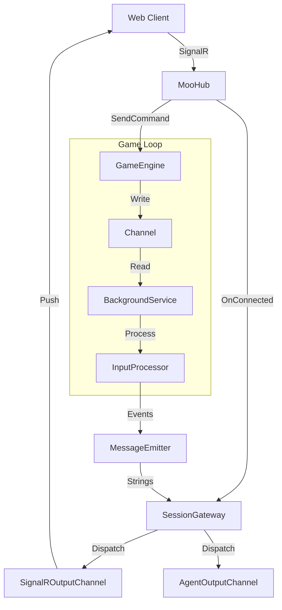

# Web & Engine Integration

MooSharp separates the game logic (The Engine) from the network transport (The Web Layer). This document outlines how the ASP.NET Core web host manages authentication, connections, and the flow of data into and out of the game simulation.

## Authentication & SignalR

The game uses standard JWT (JSON Web Tokens) for authentication, but requires specific handling for WebSockets.

1.  **Token Generation**: When a player logs in via the REST API (`/api/login`), they receive a JWT containing their `sub` (Actor ID) and `name` (Username).
2.  **Transport**: Browsers cannot send custom headers during a WebSocket handshake. Therefore, the SignalR client sends the JWT in the query string: `?access_token=eyJ...`.
3.  **Extraction**: In `ServiceCollectionExtensions.cs`, the JWT Bearer configuration uses `OnMessageReceived` to extract this token from the query string and set it on the context.
4.  **Resolution**: The `ActorIdentityResolver` service extracts the Actor ID (Guid) from the `ClaimsPrincipal`. This ensures the engine operates on immutable IDs, not connection IDs.

## Session Lifecycle

The `MooHub` does not manage game state directly. It delegates lifecycle management to the `ISessionGateway`.

### Connecting
When `MooHub.OnConnectedAsync` fires:
1.  The `ActorIdentityResolver` retrieves the Player ID.
2.  A `SignalROutputChannel` wrapper is created around the `IClientProxy`.
3.  `ISessionGateway.OnSessionStartedAsync` is called.
    *   If the player is new, the Engine spawns them into the world (`SpawnActorAsync`).
    *   If the player was **Linkdead** (see below), the disconnect timer is cancelled, and their session resumes immediately.

### Disconnecting & Linkdeath
MooSharp distinguishes between a network disconnect and a game logout.

When `MooHub.OnDisconnectedAsync` fires (e.g., tab closed, wifi lost):
1.  `ISessionGateway.OnSessionEndedAsync` is called.
2.  The session enters a **Linkdead** state. The player object remains in the game room, but has no active output channel.
3.  A background timer starts (default: 1 minute).
    *   **If the user reconnects:** The timer is disposed, and the output channel is updated.
    *   **If the timer expires:** The Gateway calls `IGameEngine.DespawnActorAsync`, saving the player to the DB and removing them from the world.

To explicitly leave, a player sends a quit command, which triggers `ISessionGateway.ForceDisconnectAsync`, bypassing the timer and despawning them immediately.

## Input Pipeline (Client → Engine)

Input handling is asynchronous and decoupled via a Channel to prevent the SignalR thread from blocking on game logic.

1.  **Client**: Invokes `MooHub.SendCommand("look")`.
2.  **Hub**: Calls `IGameEngine.ProcessInputAsync`.
3.  **Engine**: Wraps the request in an `InputCommand` record and writes it to a `Channel<GameCommand>`.
4.  **Background Service**: `GameCommandBackgroundService` reads from the channel.
5.  **Processor**: `GameInputProcessor` runs the parsing and execution logic.

## Output Pipeline (Engine → Client)

The engine does not know about SignalR. It communicates strictly via interfaces.

1.  **Command Execution**: A handler produces a `CommandResult` containing semantic `IGameEvent` objects (e.g., `PlayerMovedEvent`).
2.  **Emitter**: `SessionGatewayMessageEmitter` receives the events.
3.  **Presentation**: `IGameMessagePresenter` converts events into string descriptions (e.g., "You walk north.").
4.  **Gateway**: The emitter passes the string and the target Actor ID to `ISessionGateway.DispatchToActorAsync`.
5.  **Channel**: The Gateway looks up the active `IOutputChannel` for that ID.
    *   If the user is **Human**, this is a `SignalROutputChannel` which pushes to the WebSocket.
    *   If the user is an **Agent**, this is an `AgentOutputChannel` which pushes to the agent's internal memory queue.

## Diagram

